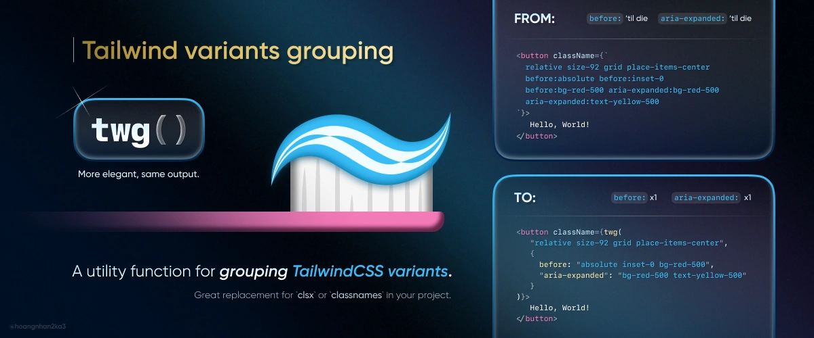
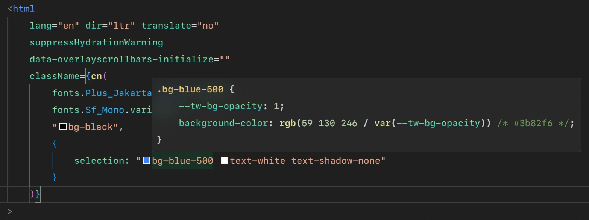
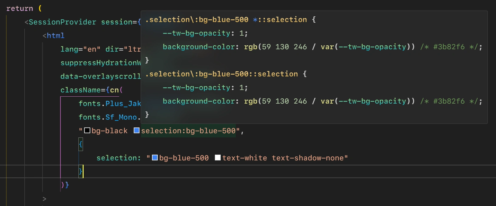

<p align="center">
  <a href="https://github.com/hoangnhan2ka3/twg/actions"></a>
  <a href="https://bundlephobia.com/result?p=twg"></a>
  <a href="https://bundlephobia.com/result?p=twg"></a>
  <a href="https://www.npmjs.com/package/twg"></a>
  <a href="https://www.npmjs.com/package/twg"></a>
  <a href="https://github.com/twg/twg/blob/main/LICENSE"></a>
</p>

<p align="center">
A more elegant way of writing Tailwind classes. Never need to repeating the same variants over and over again 🤯.
</p>

---

## 🗝️ Features

- ✅ Elegant.
- ✅ Easy setup.
- ✅ Support for multiple objects parsing.
- ✅ Support for nesting multiple objects, arrays, and itself functions.
- ✅ Support for (multiple) conditional classes, objects, and arrays.
- ✅ Customizable `callee` name and `separator`.
- ✅ Compatible with wrappers like [`twMerge`](https://github.com/dcastil/tailwind-merge).
- ✅ "Base" support for Tailwind CSS IntelliSense (IDEs extension), also [Hover Preview](https://marketplace.visualstudio.com/items?itemName=bradlc.vscode-tailwindcss#hover-preview).
- ✅ Lite version.

## 📰 News

- ✅ Major update `v2`:

  - Supports native objects behavior like `clsx` (Key as classes and value as conditionals)

    ```jsx
    twg({ foo: true, bar: false, baz: isTrue() });
    //=> "foo baz"

    twg({ "you are": true, not: false, m_y: 1, "destiny": isTrue() });
    //=> "you are m_y destiny"
    ```

  - Use `@babel` AST to parse all conditional classes, objects, arrays or even both string and array.
    - **Pros:**
      - More accurate, more trust in processing.
      - Works perfectly even with complex conditionals like nested ternary and inside template literal.
      - Reduce several complex regex use to parse condition.
      - Resolve all outstanding issues related to any kind of conditionals, nested conditionals.
    - **Cons:**
      - Currently work on _(.js, .ts, .jsx, .tsx)_ file only.
      - A bit slower, especially on the first time, when nothing is cached.
      - 4 more dependencies 😢

- ✅ Lite version:

  Same as default version, but:

  - Without any options API except for custom `callee` in [`replacer()` options](#replacer-options).
  - No `debug messages` (no console messages).
  - No `JSDoc` comments for each function.
  - 30 ~ 40% lighter.
  - 500 ~ 1000ms faster.

> [!TIP]\
> When you tested using with default version, and everything's OK. So you could want to use lite version, for better performance.

## 📖 Table of Contents

- [Quick intro](#-quick-intro)
- [Getting started](#-getting-started)
  - [1. Install the package](#1-install-the-package)
  - [2. Setup](#2-setup)
  - [3. Use](#3-use)
- [Options](#%EF%B8%8F-options)
  - [`replacer()` options](#replacer-options)
  - [`twg` options](#twg-options)
- [How to use](#-how-to-use)
  - [Basic usage](#basic-usage)
  - [Complex as ☠️ usage](#complex-as-%EF%B8%8F-usage)
  - [Conditionals](#conditionals)
- [Custom options](#-custom-options)
  - [Custom `callee`](#custom-callee)
  - [Custom `separator`](#custom-separator)
  - [Turn off `debug`](#turn-off-debug)
- [Combination](#-combination)
- [API](#-api)
- [Deeper explanation](#%EF%B8%8F-deeper-explanation)
  - [What is `twg`?](#what-is-twg)
  - [Explanation](#explanation)
  - [Trade-offs](#trade-offs)
- [Contributing](#%EF%B8%8F-contributing)
- [Credits](#-credits)

## 🚨 Quick intro

> [!TIP]\
> Simply open an Object, put the `variant` as key, and classes you want to map to that `variant` as each value.

Example:

```jsx
<div className={twg(
  "size-92 relative grid place-items-center",
  {
    before: "absolute inset-0 bg-red-500",
    "aria-expanded": "bg-red-500 text-yellow-500",
  }
)}>
  Hello, World!
</div>
```

Output (html):

```jsx
<div class="size-92 relative grid place-items-center before:absolute before:inset-0 before:bg-red-500 aria-expanded:bg-red-500 aria-expanded:text-yellow-500">
  Hello, World!
</div>
```

> [!NOTE]\
> Tested conditions

No. | Framework/Lib | Version | Additional info | Tester | Status
--- | --- | --- | --- | --- | ---
1\. | next | 15.0.0-canary.132 | with `--turbo` flag and `babel-plugin-react-compiler` enabled. | author | ✅
2\. | tailwindcss | 3.4.10 |  | author | ✅
3\. | tailwind-merge | 2.5.2 |  | author | ✅

## 🚀 Getting started

### 1. Install the package

```bash
pnpm add twg
```

### 2. Setup

```js
// tailwind.config.ts

import { type Config } from "tailwindcss"
import { replacer } from "twg/replacer"
// or
import replacer from "twg"

export default {
  content: {
    files: [
      "./src/app/**/*.{ts,tsx}",
      "./src/components/**/*.{ts,tsx}",
    ], // Move your old `content` to `content.files` like this
    transform: {
      DEFAULT: replacer() // Put `replacer()` here
    }
  },
  // Other configurations...
} satisfies Config
```

Lite version:

```js
// tailwind.config.ts

import { replacer } from "twg/lite/replacer"
// or
import replacer from "twg/lite/replacer"

// Rest like above
```

If you need to override default `replacer()` options:

```js
transform: {
  DEFAULT: replacer({
    // Define options here, eg.:
    callee: "cn"
  })
}
```

### 3. Use

```jsx
import { twg } from "twg"
// or
import twg from "twg"
```

Lite version:

```jsx
import { twg } from "twg/lite"
```

See [how to use](#-how-to-use).

If you need to override default `twg()` options:

```js
twg(
  //...,
  {
    separator: "-" // Always be the last Object
  }
)
```

For more information, consider reading [custom options](#-custom-options) and [best practice](#best-practice-with-twmerge).

## ⚙️ Options

### `replacer()` options

Options | Types | Default | Description | Lite | Status
--- | --- | --- | --- | --- | ---
`callee?` | string \| string[] | "twg" | The function name to use for detecting Tailwind classes. You can change it to whatever you defined in `lib/utils.ts`, eg. `cn`, `cx`, etc. or `["cn", "cx"]`. _(Name it as unique as possible or you'll have conflicts)_ | ✅ | ✅
`separator?`(*) | string \| false | ":" | The separator used to join the classes. If `false`, you may need to write it manually, eg.: `twg({"before:": "flex"})`. (*)Remember to sync this option with `separator` option in `twg()` option. | x | ✅
`debug` | boolean | true | Printing debug messages in console if there are any warnings or errors. If `false`, it will be silent | x | ✅

See [how to use](#-custom-options).

### `twg()` options

Options | Types | Default | Description | Lite | Status
--- | --- | --- | --- | --- | ---
`separator?`(\*) | string \| false | ":" | The separator used to join the classes. If `false`, you may need to write it manually, eg.: `twg({"before:": "flex"})`. (*)Remember to sync this option with `separator` option in `replacer()` option. | x | ✅

See [how to use](#custom-separator).

## 💡 How to use

### Basic usage

```jsx
// HelloWorld.tsx

import { twg } from "twg"
// or
import twg from "twg"

export function HelloWorld() {
  return (
    <div className={twg(
      "size-92 relative grid place-items-center px-4 py-2",
      {
        before: [
          "absolute inset-0 bg-red-500",
          {
            hover: "bg-blue-500 text-yellow-500"
          }
        ],
        "aria-expanded": "bg-red-500 text-yellow-500",
      }
    )}>
      Hello, World!
    </div>
  )
}
```

Output (html):

```html
<div class="size-92 relative grid place-items-center px-4 py-2 before:absolute before:inset-0 before:bg-red-500 before:hover:bg-blue-500 before:hover:text-yellow-500 aria-expanded:bg-red-500 aria-expanded:text-yellow-500">
  Hello, World!
</div>
```

### Complex as ☠️ usage

```jsx
// HelloWorld.tsx

import { twg } from "twg"
// or
import twg from "twg"

export function HelloWorld() {
  return (
    <div className={twg(
      "Lorem ipsum",
      "dolor sit",
      ["amet", "consectetur adipiscing elit"],
      ["Sed sit", "amet ligula", ["ex", "Ut"]],
      {
        var1: "in suscipit metus",
        var2: [
          "vel accumsan",
          "orci",
          ["Vivamus sapien", "neque", ["dictum vel", "felis maximus"]]
        ],
        var3: ["luctus", { var4: "lorem" }],
        var5: [
            "Fusce malesuada massa",
            ["eu turpis finibus"],
            {
              var6: [
                "mollis",
                {
                  var7: [
                    "In augue tortor",
                    {
                      var8: [
                        "porta eu erat sit amet",
                        ["tristique", "ullamcorper", "arcu"]
                      ]
                    }
                  ]
                }
              ]
            }
          ]
        }
    )}>
      Hello, World!
    </div>
  )
}
```

Output (html):

```html
<div class="Lorem ipsum dolor sit amet consectetur adipiscing elit Sed sit amet ligula ex Ut var1:in var1:suscipit var1:metus var2:vel var2:accumsan var2:orci var2:Vivamus var2:sapien var2:neque var2:dictum var2:vel var2:felis var2:maximus var3:luctus var3:var4:lorem var5:Fusce var5:malesuada var5:massa var5:eu var5:turpis var5:finibus var5:var6:mollis var5:var6:var7:In var5:var6:var7:augue var5:var6:var7:tortor var5:var6:var7:var8:porta var5:var6:var7:var8:eu var5:var6:var7:var8:erat var5:var6:var7:var8:sit var5:var6:var7:var8:amet var5:var6:var7:var8:tristique var5:var6:var7:var8:ullamcorper var5:var6:var7:var8:arcu">
  Hello, World!
</div>
```

### Conditionals

You can use conditional like `&& | || | ??` _(and/or)_ or `isFooBar === "twg" ? "..." : "..."` _(ternary)_ as well:

- Conditional classes:

  ```jsx
  // HelloWorld.tsx

  import { twg } from "twg"
  import { useState } from "react"

  export function HelloWorld() {
    const [isAndOr, setIsAndOr] = useState(false)
    const [isTernary, setIsTernary] = useState("foo")
    // ...
    return (
      <div className={twg(
        "size-92 relative px-4 py-2",
        isTernary === "bar" ? "grid place-items-center" : "flex items-center justify-center",
        {
          before: [
            "absolute inset-0",
            isTernary === "foo" ? "bg-red-500" : "bg-green-500",
            hover: [
              "bg-blue-500 text-yellow-500",
              isAndOr && "border-2 border-white"
            ]
          ],
          "aria-expanded": isAndOr ?? "bg-red-500 text-yellow-500"
        }
      )}>
        Hello, World!
      </div>
    )
  }
  ```

- Conditional objects:

  ```jsx
  // HelloWorld.tsx

  import { twg } from "twg"
  import { useState } from "react"

  export function HelloWorld() {
    const [isAndOr, setIsAndOr] = useState(false)
    const [isTernary, setIsTernary] = useState("foo")
    // ...
    return (
      <div className={twg(
        "size-92 relative grid place-items-center px-4 py-2",
        {
          before: [
            "absolute inset-0 bg-red-500",
            isTernary === "bar" ? {
              hover: "bg-blue-500 text-yellow-500"
            } : {
              hover: [
                "bg-blue-500 text-yellow-500",
                isAndOr && "border-2 border-white",
              ]
            }
          ],
          "aria-expanded": "bg-red-500 text-yellow-500",
        }
      )}>
        Hello, World!
      </div>
    )
  }
  ```

- Or even crazy conditional objects:

  ```jsx
  // HelloWorld.tsx

  import { twg } from "twg"
  import { useState } from "react"

  export function HelloWorld() {
    const [isAndOr, setIsAndOr] = useState(false)
    const [isTernary, setIsTernary] = useState("foo")
    // ...
    return (
      <div className={twg(
        "multiple classes",
        {
          var1: [
            "multiple classes",
            isTernary === "foo" ? {
              var2: "multiple classes"
            } : {
              var2: [
                "multiple classes",
                isAndOr && "another class",
                isTernary === "bar" ? {
                  var3: [
                    "class",
                    isTernary === "baz" ? {
                      var4: "multiple classes"
                    } : {
                      var4: ["multiple classes"]
                    }
                  ]
                } : {
                  var3: ["multiple classes"]
                }
              ]
            }
          ],
          "var-5": "multiple classes"
        }
      )} />
        Hello, World!
      </div>
    )
  }
  ```

  Output _(what Tailwind will scan, not in browser's inspect tool)_:

  ```html
  <div className="multiple classes var1:multiple var1:classes var1:var2:multiple var1:var2:classes var1:var2:multiple var1:var2:classes var1:var2:another var1:var2:class var1:var2:var3:class var1:var2:var3:var4:multiple var1:var2:var3:var4:classes var1:var2:var3:var4:multiple var1:var2:var3:var4:classes var1:var2:var3:multiple var1:var2:var3:classes var-5:multiple var-5:classes">
    Hello, World!
  </div>
  ```

- Conditional with string and array:

  ```jsx
  // HelloWorld.tsx

  import { twg } from "twg"
  import { useState } from "react"

  export function HelloWorld() {
    const [isAndOr, setIsAndOr] = useState(false)
    const [isTernary, setIsTernary] = useState("foo")
    // ...
    return (
      <div className={twg(
        "size-92 relative grid place-items-center px-4 py-2",
        {
          before: isTernary === "foo" ? [
            "absolute inset-0 bg-red-500",
            {
              hover: isTernary ? "bg-blue-500 text-yellow-500" : [
                "bg-blue-500 text-yellow-500",
                isAndOr && "border-2 border-white"
              ]
            }
          ] : [
            "fixed inset-0 bg-yellow-500",
          ],
          "aria-expanded": "bg-red-500 text-yellow-500",
        }
      )}>
        Hello, World!
      </div>
    )
  }
  ```

  Output _(what Tailwind will scan, not in browser's inspect tool)_:

  ```html
  <div className="size-92 relative grid place-items-center px-4 py-2 before:absolute before:inset-0 before:bg-red-500 before:hover:bg-blue-500 before:hover:text-yellow-500 before:hover:bg-blue-500 before:hover:text-yellow-500 before:hover:border-2 before:hover:border-white before:fixed before:inset-0 before:bg-yellow-500 aria-expanded:bg-red-500 aria-expanded:text-yellow-500">
    Hello, World!
  </div>
  ```

> [!TIP]\
> Just use `twg` as the way you use `clsx` or `classnames`, except for the `object zones` which you can use the `twg` way.

## 🔧 Custom options

### Custom `callee`

First, change the `callee` option `replacer()` to the callee's name you want, eg. with `cn`:

```js
// tailwind.config.ts

transform: {
  DEFAULT: replacer({
    callee: "cn"
  })
}
```

Then use several ways to import { match } from "assert"
import { write } from "fs"
import { after, before } from "node:test"
import { version } from "os"
import { join } from "path"
import { start } from "repl"
import itimport { debug } from "console"
import { on } from "events"
import { off } from "process"
:

- **Option 1:**

  ```jsx
  import { twg as cn } from "twg"
  ```

- **Option 2:**

  ```jsx
  // src/lib/utils.ts
  import { twg as cn } from "twg"
  export { cn }

  // src/Component.tsx
  import { cn } from "@/lib/utils"
  ```

- **Option 3:** [Use with wrapper like `twMerge` 👇](#best-practice-with-twmerge).

### Custom `separator`

Example with separator as "_", you must define the `separator` option to both `twg()` and `replacer()`:

**1. In `replacer()` options:**

```js
// tailwind.config.ts

import { type Config } from "tailwindcss"
import { replacer } from "twg/replacer"
// or
import replacer from "twg"

export default {
  content: {
    files: [
      "./src/app/**/*.{ts,tsx}",
      "./src/components/**/*.{ts,tsx}",
    ],
    transform: {
      DEFAULT: replacer({
        callee: "cn",
        separator: "_" // Define `separator` here
      })
    }
  },
  // Other configurations...
} satisfies Config
```

**2. In `twg()` options:**

```js
// src/lib/utils.ts

import { twg, type ClassValue } from "twg"
import { extendTailwindMerge } from "tailwind-merge"

export function cn(...inputs: ClassValue[]) {
  return twg(...inputs, {
    separator: "_" // Always be the last Object
  })
}
```

**3. Example:**

```jsx
// HelloWorld.tsx

import { cn } from "@/lib/utils"

export function HelloWorld() {
  return (
    <div className={cn(
      "size-92 relative grid place-items-center px-4 py-2",
      {
        before: [
          "absolute inset-0 bg-red-500",
          {
            hover: "bg-blue-500 text-yellow-500"
          }
        ],
        "aria-expanded": "bg-red-500 text-yellow-500",
      }
    )}>
      Hello, World!
    </div>
  )
}
```

Output (html):

```html
<div class="size-92 relative grid place-items-center before_absolute before_inset-0 before_bg-red-500 before_hover_bg-blue-500 before_hover_text-yellow-500 aria-expanded_bg-red-500 aria-expanded_text-yellow-500">
  Hello, World!
</div>
```

### Turn off `debug`

Printing debug messages in console if there are any warnings or errors, eg.:

```bash
⚠️ TWG - Problem occurred on `replacer()`:
utilities is not defined in:
- { utilities }
Trying to be transformed into:
+ { utilities }
```

If set to `false`, it will not print any debug messages.

## 🤝 Combination

### Best practice with [`twMerge`](https://github.com/dcastil/tailwind-merge)

```js
// tailwind.config.ts

import { type Config } from "tailwindcss"
import { replacer } from "twg/replacer"
// or
import replacer from "twg"

export default {
  content: {
    files: [
      "./src/app/**/*.{ts,tsx}",
      "./src/components/**/*.{ts,tsx}",
    ],
    transform: {
      DEFAULT: replacer({
        callee: "cn"
      })
    }
  },
  // Other configurations...
} satisfies Config
```

Default:

```js
// src/lib/utils.ts

import { twg, type ClassValue } from "twg"
import { twMerge } from "tailwind-merge"

export function cn(...inputs: ClassValue[]) {
  return twMerge(twg(...inputs))
}
```

Extend options:

```js
// src/lib/utils.ts

import { twg, type ClassValue } from "twg"
import { extendTailwindMerge } from "tailwind-merge"

const twMerge = extendTailwindMerge<...>({
  extend: { ... }
})

export function cn(...inputs: ClassValue[]) {
  return twMerge(twg(...inputs, {
    separator: "-" // Always be the last Object
  }))
}
```

## ✨ API

<details>

<summary>Click to expand/collapse this section</summary>

💥 Default version:

### `replacer({ /* options */ })(content)`

Returns: `string`

_@param_ — **[options](#replacer-options)**: callee, separator, debug

Types: `ReplacerOptions`

```js
interface ReplacerOptions {
  callee?: string | string[],
  separator?: string | false,
  debug?: boolean
}
```

_@param_ — **content**

Types: `string`

---

### `twg(...inputs)`

Returns: `string`

_@param_ — **inputs**

Types: `(ClassValue | TWGOptions)[]`

```js
type ClassValue<T = string | string[] | number | boolean | null | undefined> = T | T[] | Record<string, unknown>

interface TWGOptions {
  separator?: string | false
}
```

---

💥 Lite version:

### `replacer({ /* option */ })(content)`

Returns: `string`

_@param_ — **[options](#replacer-options)**: callee

Types: `ReplacerOptions`

```js
interface ReplacerOption {
  callee?: string | string[],
}
```

_@param_ — **content**

Types: `string`

---

### `twg(...inputs)`

Returns: `string`

_@param_ — **inputs**

Types: `ClassValue[]`

```js
type ClassValue<T = string | string[] | number | boolean | null | undefined> = T | T[] | Record<string, unknown>
```

</details>

## 🎞️ Deeper explanation

<details>

<summary>Click to expand/collapse this section</summary>

### What is `twg`?

> `twg` means `tailwind-variants-grouping`. It's actually called `tvg` but npm said there was another package called `tv4` which has a similar name so I had to rename it. In the end, I still like the name `tvg` :D.

`twg` is a combination of [`clsx`](https://github.com/lukeed/clsx/) and [`easy-tailwind`](https://github.com/Noriller/easy-tailwind), especially `easy-tailwind`, which is a phenomenal package and it is the "preflight" of this project 💕.

`twg` is a great replacement for `clsx` and [`classnames`](https://github.com/JedWatson/classnames) when you're using Tailwind CSS (or any other CSS libraries which have the [`content.transform`](https://tailwindcss.com/docs/content-configuration#transforming-source-files) API like Tailwind)

> Use the `content.transform` option to **TRANSFORM ANY CONTENT** matching a specific file extension **BEFORE EXTRACTING CLASSES**. _(Tailwind's docs)_

### Explanation

`twg` package has 02 main parts, same job but different purpose:

Function | What it does
--- | ---
`twg` | Transform classes you typed in dev code to html classes in development or production env.
`replacer()` | Transform classes you typed in dev code to normal classes and save in temp that Tailwind can scan _(the transformed code of this function does not affect anything in your end, just for Tailwind)_.

> So, as example, if you want to use custom `separator` instead of default `":"`, you must provide the `separator` option to both `twg` and `replacer()`. One for your actual code and one for Tailwind. Got the idea 😉.

- ### `twg`

  `twg`'s job is just transforming the object(s) inside itself to `map the key to each values`, outside the object and the rest processes are the job of `clsx`.

  ```jsx
  <div className={twg(
    "size-92 relative grid place-items-center", // <== clsx will handle outside the object
    {
      before: "absolute inset-0 bg-red-500",
      "aria-expanded": "bg-red-500 text-yellow-500",
    } // <== twg will handle the object
  )}>
    Hello, World!
  </div>
  ```

  Output (html):

  ```jsx
  <div class="size-92 relative grid place-items-center before:absolute before:inset-0 before:bg-red-500 aria-expanded:bg-red-500 aria-expanded:text-yellow-500">
    Hello, World!
  </div>
  ```

- ### `replacer()`

  More complex than `twg`, `replacer()` uses `regex` and some `extractor` functions to _find > replace > put it right back_ to the original `content` (which is all [`content.files`](https://tailwindcss.com/docs/content-configuration#transforming-source-files)), eg.:

  > `replacer()` was used in Tailwind API `content.transform`, but why? We already have the right classes after the process of `twg`, so why we need to do it again with `replacer()`?
  >
  > Well, Tailwind actually scans the classes in our `root code` files, not the already built code that we see in browser's inspect tool. That's why we cannot use [dynamic class names](https://tailwindcss.com/docs/content-configuration#dynamic-class-names)
  >
  > That is a reasonable existence of `content.transform`.

  ```jsx
  // ...
  <div className={twg(
    "size-92 relative grid place-items-center", // <== don't care cuz it's already valid Tailwind classes
    {
      before: "absolute inset-0 bg-red-500",
      "aria-expanded": "bg-red-500 text-yellow-500",
    } // <== replacer() just handle Object(s)
  )}>
    Hello, World!
  </div>
  //...
  ```

  Output (right before Tailwind starts to scan classes in our files):

  ```jsx
  //...
  <div className={twg(
    "size-92 relative grid place-items-center",
    "before:absolute before:inset-0 before:bg-red-500 aria-expanded:bg-red-500 aria-expanded:text-yellow-500",
  )}>
    Hello, World!
  </div>
  //...
  ```

  Then Tailwind can start extracting this `temp` code as they are our "expected classes" now 😉.

### Trade-offs

- With `Tailwind CSS IntelliSense`:

  > Does `twg` work with `Tailwind CSS IntelliSense`?

  Yes, it does, but just base support. You can just use the [Hover Preview](https://marketplace.visualstudio.com/items?itemName=bradlc.vscode-tailwindcss#hover-preview) like this:

  

  Anyway, it's fine but the `Hover Preview` does not working with full parsed classes like you typed it manually:

  

  At least it works? Right? So if you're OK with that, you're good to go.

- Remote utilities:

  You cannot use remote utilities like this:

  ```jsx
  const remoteUtils = "absolute inset-0 bg-red-500"

  <div className={twg(
    "relative grid place-items-center",
    {
      before: remoteUtils
    }
  )}>
    Hello, World!
  </div>
  ```

  If you try to use it, it will work in browser's inspect tool:

  ```html
  <div class="relative grid place-items-center before:absolute before:inset-0 before:bg-red-500">
    Hello, World!
  </div>
  ```

  But no styles will be applied because the problem comes from the `replacer()` which cannot transform these remote utilities.

  Instead, you can end up with the whole object remote:

  ```jsx
  const remoteObject = twg({
    before: "absolute inset-0 bg-red-500"
  })

  <div className={twg(
    "relative grid place-items-center",
    remoteObject,
    {
      "aria-expanded": "bg-red-500 text-yellow-500"
    }
  )}>
    Hello, World!
  </div>
  ```

- Performance:

  Yes of course, `twg` is slower than vanilla `clsx` because it uses `regex`s and `extractors` to find and replace the classes. But it's not that slow, it's still fast enough for you to use in your project. This project aim for the better developer-experience with Tailwind variants classes, not for the best performance.

  In `v2`, the `regex` is not used anymore, but it come with `@babel` AST, and it's a little bit slower than the `regex` method, especially for the first time classes was parsed and nothing was cached.

</details>

## 🎗️ Contributing

### Issues

`twg` now work for me but maybe not for you in some edges. Consider opening an [issue](https://github.com/hoangnhan2ka3/twg/issues) if you have any problem with it that I can fix it ASAP. Or a [pull request](https://github.com/hoangnhan2ka3/twg/pulls) is welcome too.

### 💪 Work with me

<https://www.linkedin.com/in/hoangnhan2ka3/>

## 🪪 Credits

### References

- [easy-tailwind](https://github.com/Noriller/easy-tailwind)
- [clsx](https://github.com/lukeed/clsx)
- [tailwind-merge](https://github.com/dcastil/tailwind-merge)

### Project starts on

- August 15, 2024

### Funding

[](https://github.com/sponsors/hoangnhan2ka3)

### License

MIT © [Nguyễn Hoàng Nhân](https://hoangnhanne.id.vn)
