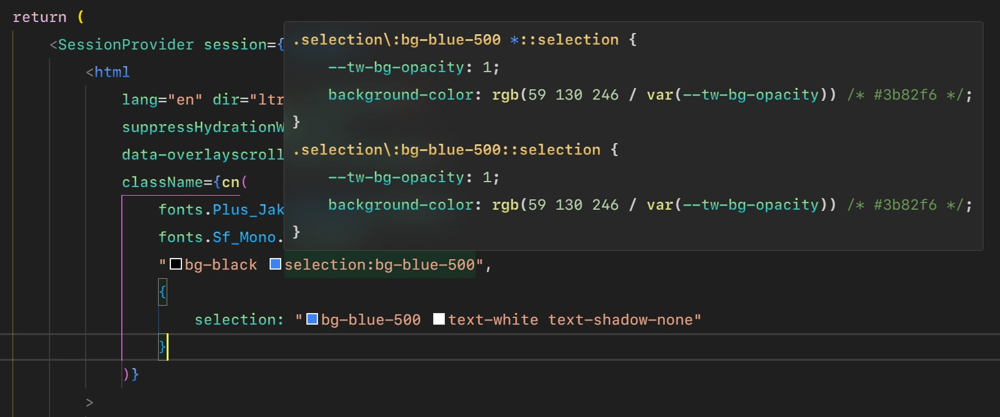

# 🎉 Introduction

## 📌 Table of contents

- [What is `twg`?](#-what-is-twg)
- [Explanation](#%EF%B8%8F-explanation)
  - [`twg()`](#twg)
  - [`replacer()`](#replacer)
- [Trade-offs](#-trade-offs)
  - [With `Tailwind CSS IntelliSense`](#-with-tailwind-css-intellisense)
  - [Remote utilities](#-remote-utilities)
  - [Performance](#-performance)

---

## 🤔 What is `twg`?

> `twg` means **tailwind-variants-grouping**. It's actually called `tvg` but npm said there was another package called `tv4` which has a similar name so I had to rename it. In the end, I still like the name `tvg` :D.

`twg` is a combination of [clsx](https://github.com/lukeed/clsx/) and [easy-tailwind](https://github.com/Noriller/easy-tailwind), especially `easy-tailwind`, which is a phenomenal package and it is the "preflight" of this project 💕.

`twg` is a great replacement for [clsx](https://github.com/lukeed/clsx/) and [classnames](https://github.com/JedWatson/classnames) when you're using Tailwind CSS (or any other CSS libraries which have the [`content.transform`](https://tailwindcss.com/docs/content-configuration#transforming-source-files) API like Tailwind)

> [!NOTE]
> Use the **_content.transform_** option to **TRANSFORM ANY CONTENT** matching a specific file extension **BEFORE EXTRACTING CLASSES**. _(Tailwind's docs)_

---

## 🎞️ Explanation

`twg` package has 02 main parts, same job but different purpose:

Function     | What it does
-------------|-----------------------------------------------------------------------------------------------------------------------------------------------------------------------------------------------------
`twg()`      | Transform classes you typed in dev code to html classes in development or production env.
`replacer()` | Transform classes you typed in dev code to normal classes and save in temp that Tailwind can scan _(the transformed code of this function does not affect anything in your end, just for Tailwind)_.

> [!IMPORTANT]
> So, as example, if you want to use custom `separator` instead of default `":"`, you must provide the `separator` option to both `twg` and `replacer()`. One for your actual code and one for Tailwind. Got the idea 😉.

- ### `twg()`

  `twg()`'s job is just transforming the object(s) inside itself to `map the key to each values`, outside the object and the rest processes are the job of `clsx`.

  ```jsx
  <div className={twg(
    "size-92 relative grid place-items-center", // <== clsx will handle outside the object
    {
      before: "absolute inset-0 bg-red-500",
      "aria-expanded": "bg-red-500 text-yellow-500",
    } // <== twg will handle the object
  )}>
    Hello, World!
  </div>
  ```

  Output (html):

  ```jsx
  <div class="size-92 relative grid place-items-center before:absolute before:inset-0 before:bg-red-500 aria-expanded:bg-red-500 aria-expanded:text-yellow-500">
    Hello, World!
  </div>
  ```

- ### `replacer()`

  More complex than `twg()`, `replacer()` uses `regex` and some `extractor` functions to _find > replace > put it right back_ to the original `content` (which is all [`content.files`](https://tailwindcss.com/docs/content-configuration#transforming-source-files)), eg.:

  > `replacer()` was used in Tailwind API `content.transform`, but why? We already have the right classes after the process of `twg()`, so why we need to do it again with `replacer()`?
  >
  > Well, Tailwind actually scans the classes in our `root code` files, not the already built code that we see in browser's inspect tool. That's why we cannot use [dynamic class names](https://tailwindcss.com/docs/content-configuration#dynamic-class-names)
  >
  > That is a reasonable existence of `content.transform`.

  ```jsx
  // ...
  <div className={twg(
    "size-92 relative grid place-items-center", // <== don't care cuz it's already valid Tailwind classes
    {
      before: "absolute inset-0 bg-red-500",
      "aria-expanded": "bg-red-500 text-yellow-500",
    } // <== replacer() just handle Object(s)
  )}>
    Hello, World!
  </div>
  //...
  ```

  Output (right before Tailwind starts to scan classes in our files):

  ```jsx
  //...
  <div className={twg(
    "size-92 relative grid place-items-center",
    "before:absolute before:inset-0 before:bg-red-500 aria-expanded:bg-red-500 aria-expanded:text-yellow-500",
  )}>
    Hello, World!
  </div>
  //...
  ```

  Then Tailwind can start extracting this `temp` code as they are our "expected classes" now 😉.

---

## 📊 Trade-offs

### ⏩ With `Tailwind CSS IntelliSense`

  > Does `twg` work with [`Tailwind CSS IntelliSense`](https://marketplace.visualstudio.com/items?itemName=bradlc.vscode-tailwindcss)?

  Yes, it does, but just base support. You can just use the [Hover Preview](https://marketplace.visualstudio.com/items?itemName=bradlc.vscode-tailwindcss#hover-preview) like this:

  

  Anyway, it's fine but the `Hover Preview` does not working with full parsed classes like you typed it manually:

  

  At least it works? Right? So if you're OK with that, you're good to go.

### ⏩ Remote utilities

  You cannot use remote utilities like this:

  ```jsx
  const remoteUtils = "absolute inset-0 bg-red-500"

  <div className={twg(
    "relative grid place-items-center",
    {
      before: remoteUtils
    }
  )}>
    Hello, World!
  </div>
  ```

  If you try to use it, it will work in browser's inspect tool:

  ```html
  <div class="relative grid place-items-center before:absolute before:inset-0 before:bg-red-500">
    Hello, World!
  </div>
  ```

  But no styles will be applied because the problem comes from the `replacer()` which cannot transform these remote utilities. **It just transforms what is already in its place**.

  Instead, you can end up with the whole object remote:

  ```jsx
  const remoteObject = twg({
    before: "absolute inset-0 bg-red-500"
  })

  <div className={twg(
    "relative grid place-items-center",
    remoteObject,
    {
      "aria-expanded": "bg-red-500 text-yellow-500"
    }
  )}>
    Hello, World!
  </div>
  ```

  Please ensure that you have the right `tailwindCSS.experimental.classRegex` inside your [`settings.json`](https://code.visualstudio.com/docs/getstarted/settings#_settings-file-locations) file (up to your IDE, my case is VSCode). Below is my recommendation ([ref](https://github.com/tailwindlabs/tailwindcss-intellisense/issues/868#issuecomment-2016530820)):

  ```json
  "tailwindCSS.experimental.classRegex": [
    [
      "(?:clsx|cn|twg|cva|classnames|classList.add)\\(([^)(]*(?:\\([^)(]*(?:\\([^)(]*(?:\\([^)(]*\\)[^)(]*)*\\)[^)(]*)*\\)[^)(]*)*)\\)",
      "'([^']*)'"
    ],
    [
      "(?:clsx|cn|twg|cva|classnames|classList.add)\\(([^)(]*(?:\\([^)(]*(?:\\([^)(]*(?:\\([^)(]*\\)[^)(]*)*\\)[^)(]*)*\\)[^)(]*)*)\\)",
      "\"([^\"]*)\""
    ],
    [
      "(?:clsx|cn|twg|cva|classnames|classList.add)\\(([^)(]*(?:\\([^)(]*(?:\\([^)(]*(?:\\([^)(]*\\)[^)(]*)*\\)[^)(]*)*\\)[^)(]*)*)\\)",
      "`([^`]*)`"
    ],
  ]
  ```

  You can replace your custom `callee` by adding it into the union `|` inside each regex.

### ⏩ Performance

- Yes of course, `twg` is slower than vanilla `clsx` because it uses `regex`s and `extractors` to find and replace the classes. But it's not that slow, it's still fast enough for you to use in your project. This project aim for the better developer-experience with Tailwind variants classes, not for the best performance.

- From `v4`, there is a `extend` version, which come with `@babel` AST, and it's a little bit slower than the `native JS` method, especially for the first time classes was parsed and nothing was cached.

> [!NOTE]
> Otherwise, if you see your style was apply so slow, consider checking also other plugins that intervene in the process of Tailwind _(eg.: wrapper like `twMerge`, which may cause the slowness)_.

---

<div align="center" width="100%">
  <table>
    <tr>
      <th width="500px">
        <div align="start">
          <a href="../docs/README.md">< Back to docs</a>
        </div>
      </th>
      <th width="500px">
        <div align="center">
          MIT © <a href="https://github.com/hoangnhan2ka3">Nguyễn Hoàng Nhân</a>
        </div>
      </th>
      <th width="500px">
        <div align="end">
          <a href="#-introduction">Scroll to top</a>
        </div>
      </th>
    </tr>
  </table>
</div>
